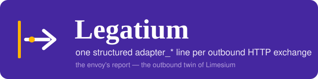

# Legatium

Legatium logs **one structured `client_*` line per outbound HTTP exchange** —
named after the Roman *legatus*, the envoy a service sends to a foreign party,
and the record of what came of it. Two auto-configured Spring Boot twins with
identical fields and identical configuration: a RestClient/RestTemplate
interceptor and a WebClient filter. No starter, no forced transitives. The
sibling project [Limesium](https://github.com/Inqudium/limesium) records the
*inbound* crossings with the same design.

| Module | Client | Root package |
|---|---|---|
| `legatium-restclient-logging` | `RestClient` / `RestTemplate` (blocking interceptor) | `eu.inqudium.legatium.restclient.logging` |
| `legatium-webclient-logging` | `WebClient` (reactive filter) | `eu.inqudium.legatium.webclient.logging` |

## Features

- **Exactly one line per call.** Emitted when the exchange is truly over — the
  response closed (RestClient) or its body terminated (WebClient) — so status,
  headers, body and duration are final; the outcome (`success` / `failure` /
  `timeout`, plus `cancelled` on the reactive stack) is decoupled from the log
  level.
- **A stable field contract.** The `client_*` wire names are a contract with
  the log index: each field owns its JSON shape, a badly typed value drops that
  field with a warning but never the event, and the Elasticsearch component
  template ships with the project — kept in lockstep with the code by contract
  tests.
- **Identity that joins.** A traced call (a `traceparent` on the outgoing
  request, put there by the host's tracing) takes its request id from the trace
  id and goes out untouched; a traceless call gets an `X-Correlation-Id` sent
  along so the peer can quote it. The identity rides the MDC as an additive
  overlay beside an inbound request's own keys.
- **Passive body capture, logged by outcome.** Bodies are captured by a
  bounded tee as they flow — nothing is replayed or withheld from the
  application — and logged `never`, `on-failure` or `always` per direction;
  `on-failure` keeps the volume at the lines a body is wanted for. Logged
  header values are masked by default to a stable `length:hash` fingerprint
  (keyed on request), plaintext being an explicit allowlist.
- **Twin symmetry as an invariant.** Both modules expose the same fields
  and the same `client-logging.*` properties; the shared reference
  configuration is contract-tested against both twins.
- **A library, not a platform.** Auto-configured Spring Boot modules with
  no starter and no forced logging transitives; the host application
  brings the client engine and the Logback binding.

## Quick start

Add the module matching your client — the interceptor or filter attaches itself
to every client Boot builds:

```xml
<dependency>
    <groupId>eu.inqudium</groupId>
    <artifactId>legatium-restclient-logging</artifactId>
    <version>...</version>
</dependency>
```

or, for `WebClient`:

```xml
<dependency>
    <groupId>eu.inqudium</groupId>
    <artifactId>legatium-webclient-logging</artifactId>
    <version>...</version>
</dependency>
```

Every `client-logging.*` key, with its default, is documented in the
[configuration reference](https://github.com/Inqudium/legatium/blob/main/docs/client-logging-reference.yml) —
copy the block and change only what you need.

## Documentation

- **[RestClient guide](https://github.com/Inqudium/legatium/blob/main/legatium-restclient-logging/docs/GUIDE.md)** —
  the long-form guide of the reference implementation: architecture,
  integration, configuration, metrics.
- **[WebClient guide](https://github.com/Inqudium/legatium/blob/main/legatium-webclient-logging/docs/GUIDE.md)** —
  the twin's guide, including the deliberate stack differences.
- **[Elasticsearch mapping](elk/README.md)** — the ready-made component
  template for the `client_*` fields.
- **[Test evidence](https://inqudium.github.io/legatium/tests/test-evidence/)** —
  the generated inventory of the test suite: every test sentence plus its
  rationale, grouped by module and component.
- **[Coverage report](https://inqudium.github.io/legatium/coverage/)** —
  the JaCoCo reports of the run that built this site.
- **API reference** —
  [RestClient](https://inqudium.github.io/legatium/api/legatium-restclient-logging/) and
  [WebClient](https://inqudium.github.io/legatium/api/legatium-webclient-logging/),
  generated with Dokka.

## Project

- [README](https://github.com/Inqudium/legatium#readme) — the full project
  story and the naming.
- [Contributing](https://github.com/Inqudium/legatium/blob/main/CONTRIBUTING.md)
- [Changelog](https://github.com/Inqudium/legatium/blob/main/CHANGELOG.md)
- [License (Apache 2.0)](https://github.com/Inqudium/legatium/blob/main/LICENSE)
